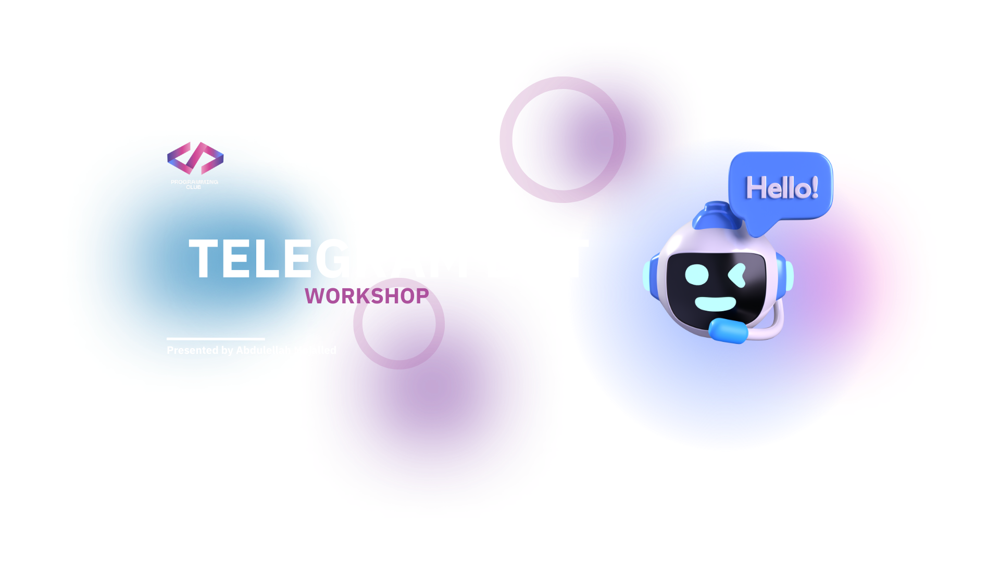

# 🤖 Telegram Bot Workshop

**By Abdulellah Mojalled**  
**Hosted by [@ProggClub_KAU](https://x.com/proggclub_kau)**

---

## 🚀 Workshop Goal

Build your **first functional Telegram bot using Python** – in a fun, hands-on way!

---

## 🔧 What You’ll Learn

- Set up a bot using [@BotFather](https://t.me/BotFather)  
- Use `pyTelegramBotAPI` to:
  - Handle commands: `/start`, `/help`, `/time`, `/calc`
  - Send welcome messages
  - Echo user input
  - Add inline buttons
  - Build a mini calculator

---

## 🛠 Requirements

- Python 3.7+
- Telegram account
- Code editor (VSCode, PyCharm, etc.)
- Install dependencies:
  ```bash
  pip install pyTelegramBotAPI python-dotenv
  ```

---

## 🧠 What You’ll Build

- 💬 Smart auto-responses  
- 🎮 Interactive inline buttons  
- ➗ A real-time calculator

---

## 📝 Workshop Resources

| 📁 **Resource**        | 🔗 **Link** |
|------------------------|-------------|
| 💻 Full Source Code     | [Click here to view](https://colab.research.google.com/drive/1PQQYzFxdpD8wxVzLclpSIfHANglwJhe6) |
| 🖥️ Slides               | [Click here to view](https://drive.google.com/file/d/1JrbEFXn3vFpDErDWtoJYrIokRXN8Oo84/view?usp=sharing) |

---

## 💬 Got Questions?

Reach out anytime!  
📢 [@AbdulallahMoj](https://x.com/abdulellahmoj) | [@ProggClub_KAU](https://x.com/proggclub_kau)

---

## 🌟 Let’s Build Something Cool Together!

Share your bot ideas, keep coding, and have fun! 🚀
